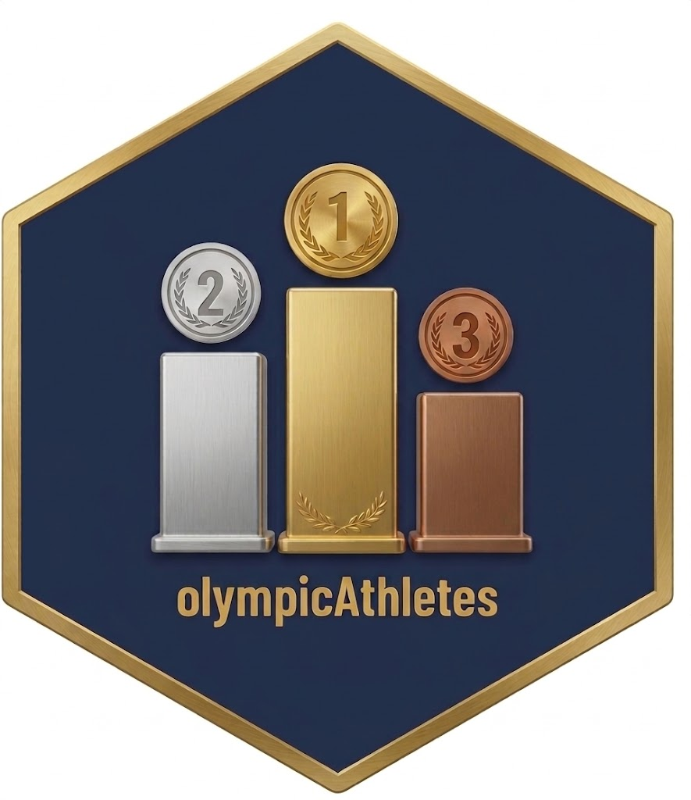

# olympicAthletes 

A tidy R data package covering every athlete-event participation in the modern
Olympic Games, **Athens 1896 through Milano-Cortina 2026** — about 315,000 rows.

## Installation

```r
# from GitHub:
# install.packages("remotes")
remotes::install_github("moderndive/olympicAthletes")
```

## Datasets

```r
library(olympicAthletes)

data(olympic_athletes)   # ~315,000 athlete-event rows, 1896-2026
data(medal_table)        # verified medal table for 2018-2026
data(editions)           # metadata for the five new editions

?olympic_athletes
```

| Dataset | Rows | Description |
|---|---:|---|
| `olympic_athletes` | 315,090 | One row per (athlete, Games, event). 15 columns. |
| `medal_table` | 273 | One row per (Games, NOC) with Gold/Silver/Bronze counts. |
| `editions` | 5 | Year, season, host city, dates, participant counts. |

The schema of `olympic_athletes` matches the original
[rgriff23/Olympic_history](https://github.com/rgriff23/Olympic_history)
dataset, so existing notebooks and analyses keep working.

## Provenance

Rows for 1896-2016 come from the rgriff23 dataset (originally scraped from
sports-reference.com). Rows for 2018-2026 were scraped from
[olympedia.org](https://www.olympedia.org/) using the pipeline in the
[olympic-moderndive-data](https://github.com/ismayc/olympic-moderndive-data)
repository. See `data-raw/DATASET.R` for the reproducible build.

## Caveats

- **Medal counts are per-player, not per-team-event.** A team gold (e.g. Ice
  Hockey Men) produces one `Medal = "Gold"` row per roster member. Group by
  `Medal` and `NOC` and divide team-event medals by team size to reproduce
  the IOC medal table — or use the `medal_table` companion dataset which
  uses the IOC convention.
- **Bio coverage** (Height/Weight) ranges from ~80% for older Winter Games
  to ~25% for Paris 2024 / Milano-Cortina 2026. Olympedia bios for newer or
  less-prominent athletes are sparse — same pattern as in the original
  1896-2016 source.

## License

CC BY 4.0. Please cite this package, the rgriff23 source, and Olympedia.

## Citation

```
Ismay, C. (2026). olympicAthletes: Olympic Athlete Event Data,
Athens 1896 to Milano-Cortina 2026. R package version 0.1.0.

Griffin, R. (2018). Olympic history: longitudinal data scraped from
www.sports-reference.com. https://github.com/rgriff23/Olympic_history

OlyMADMen. Olympedia. https://www.olympedia.org/
```
